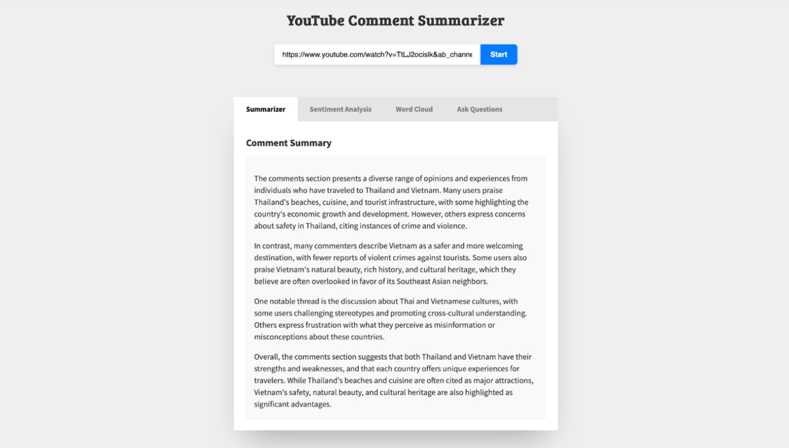
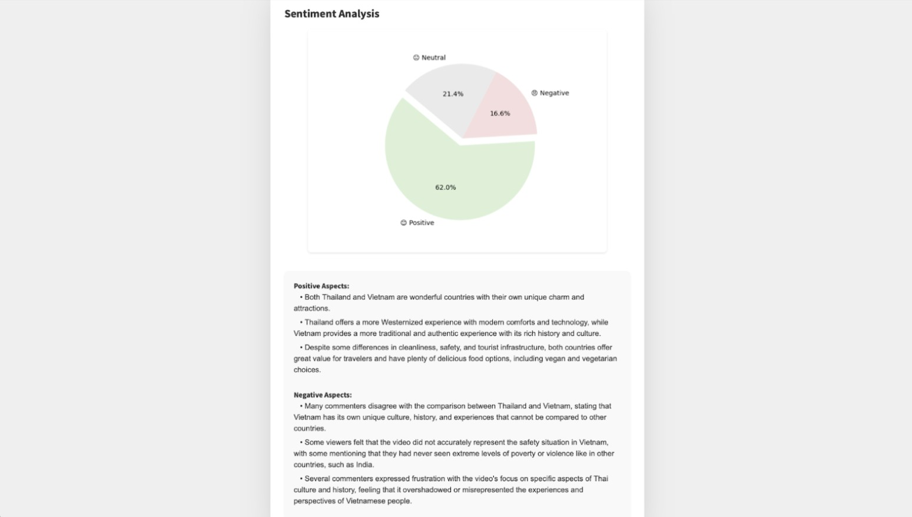
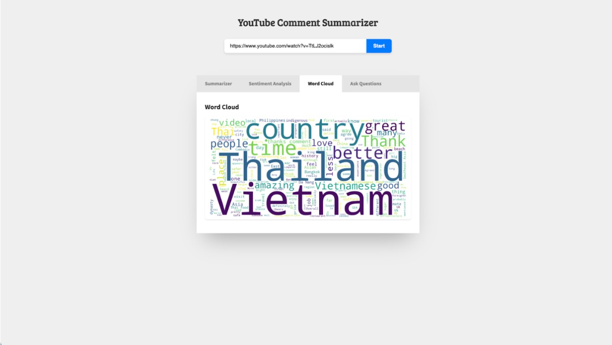
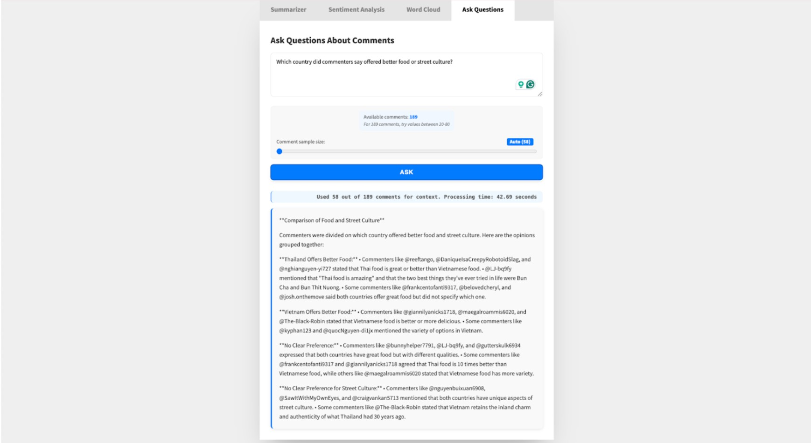

# Youtube Comment Analyzer

A powerful tool to extract insights from thousands of YouTube comments using NLP and LLMs. It supports summarization, Q&A, sentiment analysis, and word cloud visualization to help users quickly understand viewer feedback.

## Features
1. Summarizer

Automatically generates a concise summary of comments from a YouTube video.

How it works:

 - Embedding: Comments are embedded as vectors using a transformer-based embedding model.
 - RAG (Retrieval-Augmented Generation): Relevant comments are retrieved and passed to an LLM for summarization.
 - Prompt Engineering: Tailored prompts ensure high-quality, context-aware summaries.
 - Local Database: Uses ChromaDB to store and efficiently search embeddings.

2. Q&A

Ask questions in natural language and get answers based on YouTube comments.

Key features:
 - Retrieves the most relevant comments using an adaptive k retrieval algorithm:
   - 40–70% of comments for smaller datasets
   - Down to 10% for larger datasets
   - Minimum/maximum thresholds to ensure performance and relevance
- Uses RAG with an LLM to generate grounded, evidence-based responses.

3. Sentiment Analysis
Classifies each comment as positive, negative, or neutral and extracts representative ideas.

Implementation:
  - Compared Hugging Face models and VADER; selected fine-tuned RoBERTa for its contextual accuracy.
  - Comments are categorized into sentiment buckets and stored in separate in-memory vector stores.
  - RAG + LLaMA 3.2 + mxbai-embed-large used to summarize core ideas from each sentiment group.


4. WordCloud

Visualizes the most frequent words in the comments.

Preprocessing steps:
 - Stopword Removal: Removes common English stopwords.
 - Lemmatization: Uses NLTK’s WordNetLemmatizer to reduce words to base forms (e.g., "running" → "run").
 - Comments are concatenated and passed to the WordCloud library for visualization.

## How to run the project

1. Install Dependencies
```pip install -r requirements.txt```

2. Install Ollama (if not installed)

   Download and install Ollama from: https://ollama.com/download

3. Pull the LLaMA 3.2 Model & embedding model
   
```ollama run llama3.2```

```ollama  mxbai-embed-large```

5. Start the Application
```python app.py```

## Example







